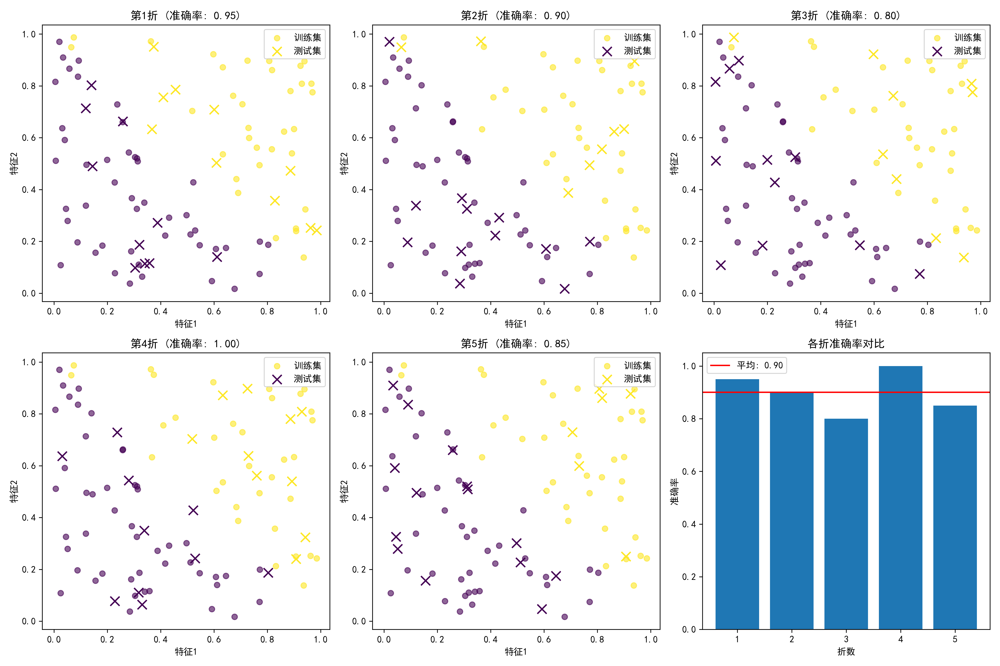
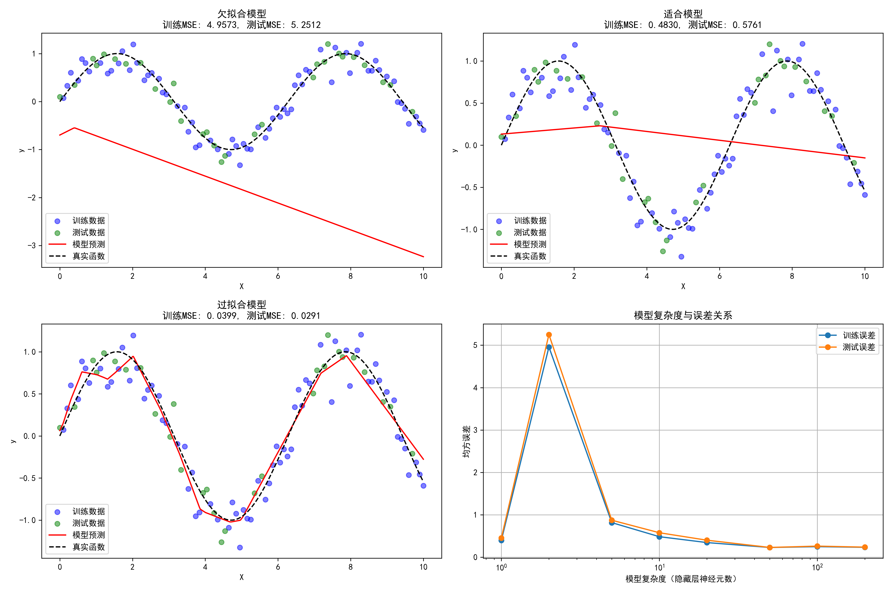
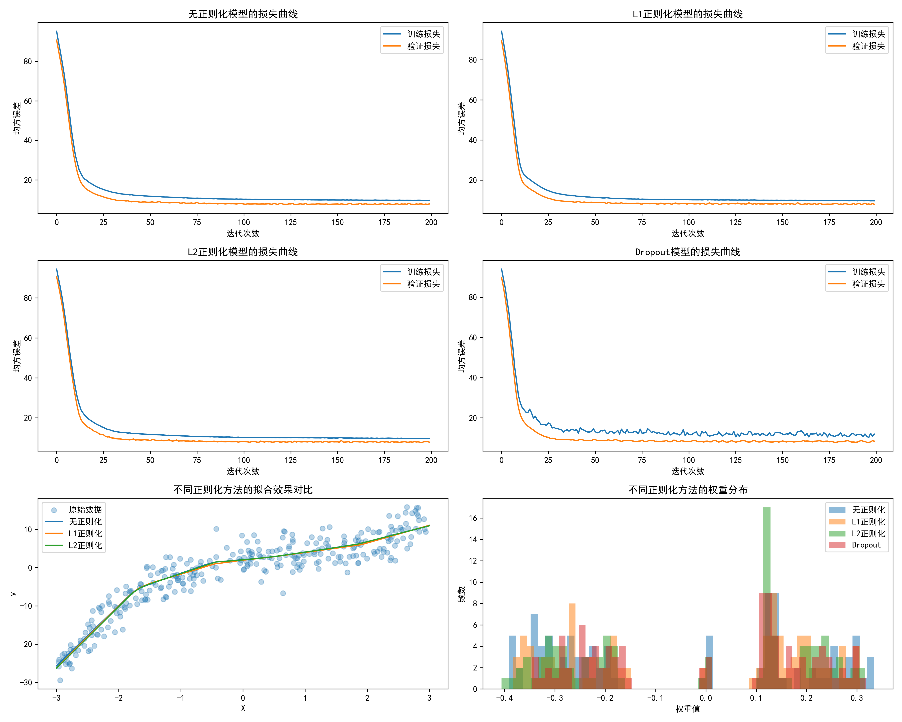
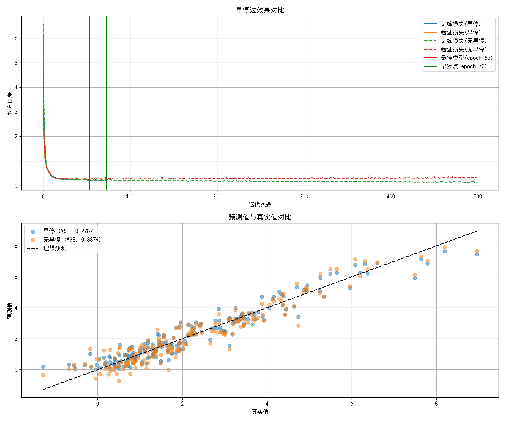

# 第6章模型评估和正则化

第6章模型评估和正则化
现在我们已经知道如何建立一个基本的神经网络模型。在本章中，我们将学习评估神经网络模型的方法，讨论神经网络模型经常会出现的两个问题--欠拟合和过拟合。

我将为您扩展第6章的内容，包括数学原理、示例、代码实现和可视化。

## 1. 模型评估

### 1.1 评估指标

在机器学习中，我们需要客观地评估模型性能。常用的评估指标包括：

#### 分类问题
- **准确率(Accuracy)**: 正确预测的样本数占总样本数的比例
  $$Accuracy = \frac{TP + TN}{TP + TN + FP + FN}$$
- **精确率(Precision)**: 在预测为正的样本中，真正为正的比例
  $$Precision = \frac{TP}{TP + FP}$$
- **召回率(Recall)**: 在所有真实为正的样本中，被正确预测为正的比例
  $$Recall = \frac{TP}{TP + FN}$$
- **F1分数**: 精确率和召回率的调和平均
  $$F1 = \frac{2 \times Precision \times Recall}{Precision + Recall}$$

#### 回归问题
- **均方误差(MSE)**: 
  $$MSE = \frac{1}{n}\sum_{i=1}^{n}(y_i - \hat{y}_i)^2$$
- **平均绝对误差(MAE)**:
  $$MAE = \frac{1}{n}\sum_{i=1}^{n}|y_i - \hat{y}_i|$$
- **R²分数**: 模型解释的方差比例
  $$R^2 = 1 - \frac{\sum_{i=1}^{n}(y_i - \hat{y}_i)^2}{\sum_{i=1}^{n}(y_i - \bar{y})^2}$$

### 1.2 交叉验证 cross-validation

交叉验证是一种评估模型泛化能力的方法，常见的包括：

- **k折交叉验证(k-fold cross-validation)**: 将数据集分成k个子集，每次使用k-1个子集训练，剩下的1个子集用于测试。

```python:e:\Desktop\深度学习\第6章模型评估和正则化\cross_validation.py
import numpy as np
from sklearn.model_selection import KFold
from sklearn.neural_network import MLPClassifier
from sklearn.metrics import accuracy_score
import matplotlib.pyplot as plt

# 生成示例数据
np.random.seed(42)
X = np.random.rand(100, 2)
y = (X[:, 0] + X[:, 1] > 1).astype(int)

# 设置k折交叉验证
k = 5
kf = KFold(n_splits=k, shuffle=True, random_state=42)

# 存储每折的准确率
fold_accuracies = []

plt.figure(figsize=(15, 10))
for i, (train_index, test_index) in enumerate(kf.split(X)):
    X_train, X_test = X[train_index], X[test_index]
    y_train, y_test = y[train_index], y[test_index]
    
    # 训练模型
    model = MLPClassifier(hidden_layer_sizes=(5,), max_iter=1000, random_state=42)
    model.fit(X_train, y_train)
    
    # 预测并计算准确率
    y_pred = model.predict(X_test)
    accuracy = accuracy_score(y_test, y_pred)
    fold_accuracies.append(accuracy)
    
    # 可视化每折的训练集和测试集
    plt.subplot(2, 3, i+1)
    plt.scatter(X_train[:, 0], X_train[:, 1], c=y_train, cmap='viridis', alpha=0.6, marker='o', label='训练集')
    plt.scatter(X_test[:, 0], X_test[:, 1], c=y_test, cmap='viridis', alpha=1.0, marker='x', s=100, label='测试集')
    plt.title(f'第{i+1}折 (准确率: {accuracy:.2f})')
    plt.xlabel('特征1')
    plt.ylabel('特征2')
    plt.legend()

# 显示平均准确率
plt.subplot(2, 3, 6)
plt.bar(range(1, k+1), fold_accuracies)
plt.axhline(y=np.mean(fold_accuracies), color='r', linestyle='-', label=f'平均: {np.mean(fold_accuracies):.2f}')
plt.xlabel('折数')
plt.ylabel('准确率')
plt.title('各折准确率对比')
plt.legend()

plt.tight_layout()
plt.savefig('e:\\Desktop\\深度学习\\第6章模型评估和正则化\\cross_validation.png', dpi=300)
plt.show()
```



## 2. 欠拟合与过拟合

### 2.1 问题定义

- **欠拟合(Underfitting)**: 模型过于简单，无法捕捉数据中的模式，在训练集上表现不佳。
- **过拟合(Overfitting)**: 模型过于复杂，捕捉了数据中的噪声，在训练集上表现很好但在测试集上表现差。

### 2.2 数学原理

从偏差-方差分解的角度看，预测误差可以分解为：

$$E[(y - \hat{f}(x))^2] = (Bias[\hat{f}(x)])^2 + Var[\hat{f}(x)] + \sigma^2$$

其中：
- **偏差(Bias)**: 模型预测的期望与真实值的差距，反映欠拟合程度
- **方差(Variance)**: 模型预测的变化程度，反映过拟合程度
- **噪声(σ²)**: 数据本身的不可约误差

```python:e:\Desktop\深度学习\第6章模型评估和正则化\bias_variance.py
import numpy as np
import matplotlib.pyplot as plt
from sklearn.neural_network import MLPRegressor
from sklearn.model_selection import train_test_split
from sklearn.metrics import mean_squared_error

# 生成带噪声的数据
np.random.seed(42)
X = np.linspace(0, 10, 100).reshape(-1, 1)
y_true = np.sin(X.ravel())
y = y_true + 0.2 * np.random.randn(100)

# 划分训练集和测试集
X_train, X_test, y_train, y_test = train_test_split(X, y, test_size=0.3, random_state=42)

# 创建不同复杂度的模型
models = {
    '欠拟合模型': MLPRegressor(hidden_layer_sizes=(2,), max_iter=1000, random_state=42),
    '适合模型': MLPRegressor(hidden_layer_sizes=(10,), max_iter=1000, random_state=42),
    '过拟合模型': MLPRegressor(hidden_layer_sizes=(100, 100), max_iter=1000, random_state=42)
}

plt.figure(figsize=(15, 10))

# 训练模型并可视化
for i, (name, model) in enumerate(models.items()):
    model.fit(X_train, y_train)
    
    # 预测
    y_train_pred = model.predict(X_train)
    y_test_pred = model.predict(X_test)
    
    # 计算误差
    train_mse = mean_squared_error(y_train, y_train_pred)
    test_mse = mean_squared_error(y_test, y_test_pred)
    
    # 可视化
    plt.subplot(2, 2, i+1)
    plt.scatter(X_train, y_train, color='blue', alpha=0.5, label='训练数据')
    plt.scatter(X_test, y_test, color='green', alpha=0.5, label='测试数据')
    
    # 排序X以便绘制平滑曲线
    X_plot = np.linspace(0, 10, 1000).reshape(-1, 1)
    y_plot = model.predict(X_plot)
    
    plt.plot(X_plot, y_plot, color='red', label='模型预测')
    plt.plot(X_plot, np.sin(X_plot.ravel()), color='black', linestyle='--', label='真实函数')
    
    plt.title(f'{name}\n训练MSE: {train_mse:.4f}, 测试MSE: {test_mse:.4f}')
    plt.xlabel('X')
    plt.ylabel('y')
    plt.legend()

# 绘制训练集和测试集误差随模型复杂度变化的曲线
plt.subplot(2, 2, 4)
complexities = [1, 2, 5, 10, 20, 50, 100, 200]
train_errors = []
test_errors = []

for complexity in complexities:
    model = MLPRegressor(hidden_layer_sizes=(complexity,), max_iter=1000, random_state=42)
    model.fit(X_train, y_train)
    
    train_pred = model.predict(X_train)
    test_pred = model.predict(X_test)
    
    train_errors.append(mean_squared_error(y_train, train_pred))
    test_errors.append(mean_squared_error(y_test, test_pred))

plt.plot(complexities, train_errors, 'o-', label='训练误差')
plt.plot(complexities, test_errors, 'o-', label='测试误差')
plt.xscale('log')
plt.xlabel('模型复杂度（隐藏层神经元数）')
plt.ylabel('均方误差')
plt.title('模型复杂度与误差关系')
plt.legend()
plt.grid(True)

plt.tight_layout()
plt.savefig('e:\\Desktop\\深度学习\\第6章模型评估和正则化\\fitting_comparison.png', dpi=300)
plt.show()
```



## 3. 正则化方法

正则化是防止过拟合的重要技术，主要包括：

### 3.1 L1正则化（Lasso）

L1正则化通过在损失函数中添加权重绝对值之和的惩罚项：

$$L_{L1} = L_0 + \lambda \sum_{i=1}^{n} |w_i|$$

特点：
- 倾向于产生稀疏解（许多权重为0）
- 可以用于特征选择

### 3.2 L2正则化（Ridge）

L2正则化通过在损失函数中添加权重平方和的惩罚项：

$$L_{L2} = L_0 + \lambda \sum_{i=1}^{n} w_i^2$$

特点：
- 倾向于使所有权重都变小但不为0
- 对多重共线性问题有效

### 3.3 Dropout

Dropout是神经网络中常用的正则化技术，在训练过程中随机"丢弃"一部分神经元：

- 训练时：每个神经元以概率p被暂时从网络中移除
- 测试时：所有神经元都参与，但输出乘以(1-p)进行缩放

数学上，Dropout可以看作是对指数级数量的不同网络结构的集成学习。

```python:e:\Desktop\深度学习\第6章模型评估和正则化\regularization.py
import numpy as np
import matplotlib.pyplot as plt
import tensorflow as tf
from tensorflow.keras.models import Sequential
from tensorflow.keras.layers import Dense, Dropout
from tensorflow.keras.regularizers import l1, l2
from sklearn.model_selection import train_test_split
from sklearn.preprocessing import StandardScaler

# 设置中文显示
plt.rcParams['font.sans-serif'] = ['SimHei']
plt.rcParams['axes.unicode_minus'] = False

# 生成非线性数据
np.random.seed(42)
X = np.random.uniform(-3, 3, size=(300, 1))
y = 0.5 * X.ravel()**3 - X.ravel()**2 + 2 * X.ravel() + 2 + np.random.normal(0, 3, size=300)

# 标准化
scaler = StandardScaler()
X_scaled = scaler.fit_transform(X)

# 划分数据集
X_train, X_test, y_train, y_test = train_test_split(X_scaled, y, test_size=0.3, random_state=42)

# 定义不同正则化的模型
def create_model(regularization=None, dropout_rate=0.0):
    model = Sequential()
    
    if regularization == 'l1':
        model.add(Dense(100, activation='relu', kernel_regularizer=l1(0.01), input_shape=(1,)))
    elif regularization == 'l2':
        model.add(Dense(100, activation='relu', kernel_regularizer=l2(0.01), input_shape=(1,)))
    else:
        model.add(Dense(100, activation='relu', input_shape=(1,)))
    
    if dropout_rate > 0:
        model.add(Dropout(dropout_rate))
    
    model.add(Dense(100, activation='relu'))
    
    if dropout_rate > 0:
        model.add(Dropout(dropout_rate))
    
    model.add(Dense(1, activation='linear'))
    
    model.compile(optimizer='adam', loss='mse')
    return model

# 创建不同的模型
models = {
    '无正则化': create_model(),
    'L1正则化': create_model(regularization='l1'),
    'L2正则化': create_model(regularization='l2'),
    'Dropout': create_model(dropout_rate=0.3)
}

# 训练模型并可视化
plt.figure(figsize=(15, 12))

for i, (name, model) in enumerate(models.items()):
    # 训练模型
    history = model.fit(
        X_train, y_train,
        epochs=200,
        batch_size=32,
        validation_data=(X_test, y_test),
        verbose=0
    )
    
    # 绘制损失曲线
    plt.subplot(3, 2, i+1)
    plt.plot(history.history['loss'], label='训练损失')
    plt.plot(history.history['val_loss'], label='验证损失')
    plt.title(f'{name}模型的损失曲线')
    plt.xlabel('迭代次数')
    plt.ylabel('均方误差')
    plt.legend()
    
    # 预测并绘制拟合曲线
    X_plot = np.linspace(-3, 3, 1000).reshape(-1, 1)
    X_plot_scaled = scaler.transform(X_plot)
    y_plot = model.predict(X_plot_scaled).ravel()
    
    if i == len(models) - 1:  # 最后一个子图用于比较所有模型
        continue
        
    plt.subplot(3, 2, 5)
    if i == 0:
        plt.scatter(X, y, alpha=0.3, label='原始数据')
    plt.plot(X_plot, y_plot, label=name)
    plt.title('不同正则化方法的拟合效果对比')
    plt.xlabel('X')
    plt.ylabel('y')
    plt.legend()

# 比较不同模型的权重分布
plt.subplot(3, 2, 6)
for name, model in models.items():
    # 获取第一层的权重
    weights = model.layers[0].get_weights()[0].flatten()
    plt.hist(weights, bins=50, alpha=0.5, label=name)

plt.title('不同正则化方法的权重分布')
plt.xlabel('权重值')
plt.ylabel('频数')
plt.legend()

plt.tight_layout()
plt.savefig('e:\\Desktop\\深度学习\\第6章模型评估和正则化\\regularization_comparison.png', dpi=300)
plt.show()
```


### 3.4 早停法(Early Stopping)

早停法是一种简单有效的正则化技术，通过监控验证集上的性能，在过拟合开始前停止训练：

1. 在每个训练周期后评估验证集性能
2. 如果验证集性能连续n个周期没有改善，则停止训练
3. 返回验证集性能最好的模型参数

```python:e:\Desktop\深度学习\第6章模型评估和正则化\early_stopping.py
import numpy as np
import matplotlib.pyplot as plt
import tensorflow as tf
from tensorflow.keras.models import Sequential
from tensorflow.keras.layers import Dense
from tensorflow.keras.callbacks import EarlyStopping
from sklearn.model_selection import train_test_split
from sklearn.preprocessing import StandardScaler

# 设置中文显示
plt.rcParams['font.sans-serif'] = ['SimHei']
plt.rcParams['axes.unicode_minus'] = False

# 生成复杂数据
np.random.seed(42)
X = np.random.uniform(-3, 3, size=(500, 2))
y = 0.5 * X[:, 0]**2 + 0.2 * X[:, 1]**2 + 0.3 * X[:, 0] * X[:, 1] + 0.1 * np.sin(X[:, 0] * X[:, 1]) + np.random.normal(0, 0.5, size=500)

# 标准化
scaler = StandardScaler()
X_scaled = scaler.fit_transform(X)

# 划分数据集
X_train, X_val, y_train, y_val = train_test_split(X_scaled, y, test_size=0.3, random_state=42)

# 创建模型
def create_model():
    model = Sequential([
        Dense(100, activation='relu', input_shape=(2,)),
        Dense(100, activation='relu'),
        Dense(100, activation='relu'),
        Dense(1, activation='linear')
    ])
    model.compile(optimizer='adam', loss='mse')
    return model

# 创建两个相同的模型
model_with_early_stopping = create_model()
model_without_early_stopping = create_model()

# 设置早停
early_stopping = EarlyStopping(
    monitor='val_loss',
    patience=20,
    restore_best_weights=True,
    verbose=1
)

# 训练模型
history_with_es = model_with_early_stopping.fit(
    X_train, y_train,
    epochs=500,
    batch_size=32,
    validation_data=(X_val, y_val),
    callbacks=[early_stopping],
    verbose=0
)

history_without_es = model_without_early_stopping.fit(
    X_train, y_train,
    epochs=500,
    batch_size=32,
    validation_data=(X_val, y_val),
    verbose=0
)

# 可视化
plt.figure(figsize=(12, 10))

# 绘制损失曲线
plt.subplot(2, 1, 1)
plt.plot(history_with_es.history['loss'], label='训练损失(早停)')
plt.plot(history_with_es.history['val_loss'], label='验证损失(早停)')
plt.plot(history_without_es.history['loss'], label='训练损失(无早停)', linestyle='--')
plt.plot(history_without_es.history['val_loss'], label='验证损失(无早停)', linestyle='--')

# 标记早停点
stopped_epoch = len(history_with_es.history['loss'])
min_val_loss = min(history_with_es.history['val_loss'])
min_val_loss_epoch = history_with_es.history['val_loss'].index(min_val_loss)

plt.axvline(x=min_val_loss_epoch, color='r', linestyle='-', label=f'最佳模型(epoch {min_val_loss_epoch})')
plt.axvline(x=stopped_epoch-1, color='g', linestyle='-', label=f'早停点(epoch {stopped_epoch-1})')

plt.title('早停法效果对比')
plt.xlabel('迭代次数')
plt.ylabel('均方误差')
plt.legend()
plt.grid(True)

# 绘制预测对比
plt.subplot(2, 1, 2)

# 生成测试数据
X_test = np.random.uniform(-3, 3, size=(200, 2))
y_test = 0.5 * X_test[:, 0]**2 + 0.2 * X_test[:, 1]**2 + 0.3 * X_test[:, 0] * X_test[:, 1] + 0.1 * np.sin(X_test[:, 0] * X_test[:, 1]) + np.random.normal(0, 0.5, size=200)
X_test_scaled = scaler.transform(X_test)

# 预测
y_pred_with_es = model_with_early_stopping.predict(X_test_scaled).ravel()
y_pred_without_es = model_without_early_stopping.predict(X_test_scaled).ravel()

# 计算MSE
mse_with_es = np.mean((y_test - y_pred_with_es)**2)
mse_without_es = np.mean((y_test - y_pred_without_es)**2)

plt.scatter(y_test, y_pred_with_es, alpha=0.5, label=f'早停 (MSE: {mse_with_es:.4f})')
plt.scatter(y_test, y_pred_without_es, alpha=0.5, label=f'无早停 (MSE: {mse_without_es:.4f})')
plt.plot([min(y_test), max(y_test)], [min(y_test), max(y_test)], 'k--', label='理想预测')
plt.title('预测值与真实值对比')
plt.xlabel('真实值')
plt.ylabel('预测值')
plt.legend()
plt.grid(True)

plt.tight_layout()
plt.savefig('e:\\Desktop\\深度学习\\第6章模型评估和正则化\\early_stopping.png', dpi=300)
plt.show()
```




## 4. 总结

模型评估和正则化是深度学习中至关重要的环节：

1. **模型评估**帮助我们客观地衡量模型性能，常用方法包括：
   - 分类指标：准确率、精确率、召回率、F1分数
   - 回归指标：MSE、MAE、R²
   - 交叉验证：k折交叉验证、留一法等

2. **欠拟合与过拟合**是模型训练中常见的两个问题：
   - 欠拟合：模型过于简单，无法捕捉数据中的模式
   - 过拟合：模型过于复杂，捕捉了数据中的噪声

3. **正则化方法**可以有效防止过拟合：
   - L1正则化：产生稀疏解，适合特征选择
   - L2正则化：使权重均匀变小，适合处理多重共线性
   - Dropout：随机丢弃神经元，相当于集成学习
   - 早停法：在过拟合开始前停止训练

通过合理的模型评估和正则化技术，我们可以构建出既能很好拟合训练数据，又具有良好泛化能力的深度学习模型。