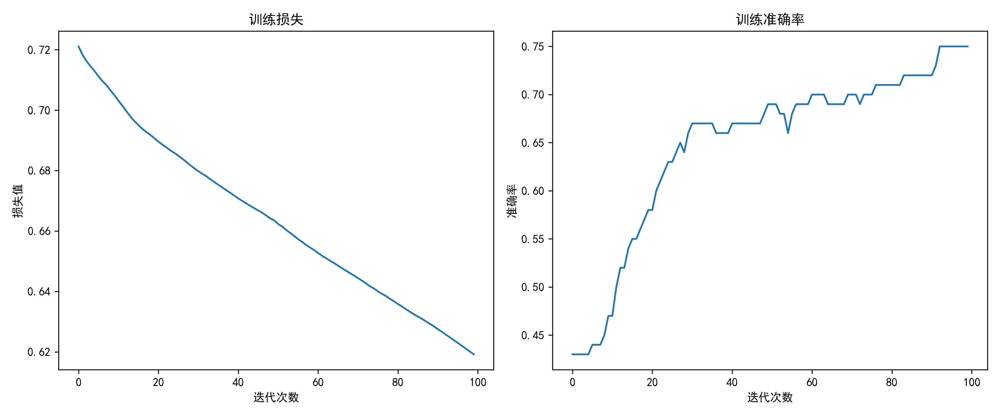
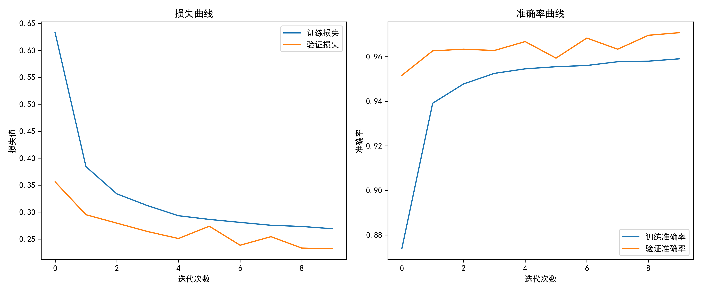
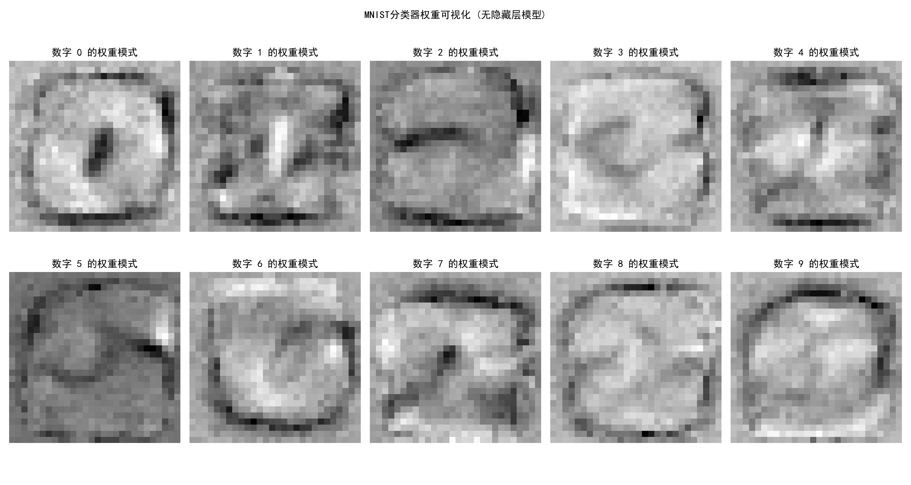

# 第7章 基于TensorFlow 2建立深度学习模型

第7章 基于TensorFlow 2建立深度学习模型
通过对前面几章的学习，我们已经学会了如何使用 Python 的基本函数(包括 NumPy 的函数)建立神经网络模型，如何使用正向传播算法、反向传播算法及梯度下降法训练神经网络,如何评估神经网络模型的模型误差及控制过拟合。然而，当处理复杂问题时，建立的神经网络模型需要更加复杂的结构和多样化的控制过拟合的方法。这时，每次建立神经网络模型都从最基础的 Python 语句开始会非常困难，容易出错，而且运行效率低。因此，大型科技公司或者高校研究团队开发了深度学习框架，旨在提高深度学习的应用效率。目前较流行的深度学习框架有TensorFlow、PyTorch、Caffe、Theano、MXNet 等。
TensorFlow 是一个开源深度学习框架，由 Google 推出并且维护，拥有较大的用户群体和社区。TensorFlow的优点如下，
易用性。TensorFlow 提供大量容易理解且可读性强的函数，使得它的工作流程相对容
易，兼容性好。例如，TensorFlow 可以很好地与NumPy结合，让数据科学家更容易理解和使用。灵活性。TensorFlow 能够在各种类型的设备上运行，从手机到超级计算机。TensorFlow可以很好地支持分布式计算，可以同时在多个CPU 或者 GPU 上运行。高效性。TensorFlow 在计算资源要求高的部分采用 C++编写，且开发团队花费了大量时间和精力来改进 TensorFlow 的大部分代码。随着越来越多开发人员的努力，TensorFlow 的运行效率不断提高。
具有良好的支持:TensorFlow有Google 团队支持:Google 在自己的日常工作中也使用 TensorFlow，并且持续对其提供支持，在 TensorFlow 周围形成了一个强大社区。
本章将介绍如何使用 TensorFlow2 建立深度学习模型:


习题
1.分析 Default 数据，使用 TensorFlow2 建立 logistic 模型:
2.分析 MNIST 数据集，使用 TensorFlow 2建立具有3个隐藏层的神经网络模型，尝试用不同的正则化方法控制过拟合。
3.分析 MNIST 数据集，使用 TensorFlow2建立神经网络模型，尝试不同的隐藏层个数、隐藏层节点数和正则化方法。在建模过程中，把数据分成训练数据、验证数据和测试数据，使用训练数据建立神经网络模型，并且使用验证数据计算验证误差，选择合适的隐藏层个数、隐藏层的节点数及正则化方法。神经网络模型的测试正确率最高可以达到多少?
4.分析 Fashion-MNIST 数据集，使用 TensorFlow2 建立神经网络模型，!尝试不同的隐藏层个数、隐藏层节点数和正则化方法。在建模过程中，把数据分成训练数据、验证数据和测试数据，使用训练数据建立神经网络模型，并且使用验证数据计算验证误差，选择合适的隐藏层个数、隐藏层的节点数及正则化方法。神经网络模型的测试正确率是多少?
5.分析 MNIST 数据集，使用 TensorFlow 2 建立没有隐藏层的神经网络模型，得到权重矩阵，把权重矩阵的每一列都变成28x28的矩阵，然后绘制图形，观察图形特征，思考权重在神经网络中的意义。


## 1. TensorFlow 2基础

### 1.1 计算图与张量

TensorFlow使用计算图表示数学运算：
- **节点**：表示数学运算
- **边**：表示张量（多维数组）

数学表示：
$$ \mathbf{y} = \sigma(\mathbf{W}\mathbf{x} + \mathbf{b}) $$

### 1.2 张量操作

```python:e:\Desktop\深度学习\第7章基于TensorFlow 2建立深度学习模型\tf2_basics.py
import tensorflow as tf
import matplotlib.pyplot as plt

# 设置中文显示
plt.rcParams['font.sans-serif'] = ['SimHei']
plt.rcParams['axes.unicode_minus'] = False

# 创建张量
a = tf.constant([[1, 2], [3, 4]], dtype=tf.float32)
b = tf.constant([[5, 6], [7, 8]], dtype=tf.float32)

# 矩阵乘法
c = tf.matmul(a, b)

print("矩阵乘法结果:\n", c.numpy())

# 可视化
plt.figure(figsize=(10, 4))
plt.subplot(1, 3, 1)
plt.imshow(a, cmap='viridis')
plt.title('矩阵A')
plt.colorbar()

plt.subplot(1, 3, 2)
plt.imshow(b, cmap='viridis')
plt.title('矩阵B')
plt.colorbar()

plt.subplot(1, 3, 3)
plt.imshow(c, cmap='viridis')
plt.title('乘积结果')
plt.colorbar()

plt.tight_layout()
plt.savefig('e:\\Desktop\\深度学习\\第7章基于TensorFlow 2建立深度学习模型\\matrix_multiplication.png', dpi=300)
plt.show()
```

## 2. 神经网络构建

### 2.1 全连接层数学原理

全连接层公式：
$$ \mathbf{h} = \sigma(\mathbf{W}\mathbf{x} + \mathbf{b}) $$

其中：
- $\mathbf{W}$: 权重矩阵
- $\mathbf{b}$: 偏置向量
- $\sigma$: 激活函数

### 2.2 全连接层代码实现

```python:e:\Desktop\深度学习\第7章基于TensorFlow 2建立深度学习模型\fc_network.py
import tensorflow as tf
from tensorflow.keras.layers import Dense
import numpy as np
import matplotlib.pyplot as plt

# 生成数据
np.random.seed(42)
X = np.random.rand(100, 2)
y = (X[:, 0] + X[:, 1] > 1).astype(int)

# 构建模型
model = tf.keras.Sequential([
    Dense(4, activation='relu', input_shape=(2,), name='hidden_layer'),
    Dense(1, activation='sigmoid', name='output_layer')
])

# 编译模型
model.compile(optimizer='adam',
              loss='binary_crossentropy',
              metrics=['accuracy'])

# 训练模型
history = model.fit(X, y, epochs=100, verbose=0)

# 可视化训练过程
plt.figure(figsize=(12, 5))
plt.subplot(1, 2, 1)
plt.plot(history.history['loss'])
plt.title('训练损失')
plt.xlabel('迭代次数')
plt.ylabel('损失值')

plt.subplot(1, 2, 2)
plt.plot(history.history['accuracy'])
plt.title('训练准确率')
plt.xlabel('迭代次数')
plt.ylabel('准确率')

plt.tight_layout()
plt.savefig('e:\\Desktop\\深度学习\\第7章基于TensorFlow 2建立深度学习模型\\training_curve.png', dpi=300)
plt.show()
```


## 3. 习题解答示例

### 3.1 MNIST分类（习题2）
习题
2.分析 MNIST 数据集，使用 TensorFlow 2建立具有3个隐藏层的神经网络模型，尝试用不同的正则化方法控制过拟合。
```python:e:\Desktop\深度学习\第7章基于TensorFlow 2建立深度学习模型\mnist_classification.py
import tensorflow as tf
from tensorflow.keras.layers import Dense, Dropout
from tensorflow.keras.regularizers import l2
import matplotlib.pyplot as plt

# 加载数据
mnist = tf.keras.datasets.mnist
(X_train, y_train), (X_test, y_test) = mnist.load_data()
X_train, X_test = X_train / 255.0, X_test / 255.0

# 构建带正则化的模型
model = tf.keras.Sequential([
    tf.keras.layers.Flatten(input_shape=(28, 28)),
    Dense(128, activation='relu', kernel_regularizer=l2(0.001)),
    Dropout(0.2),
    Dense(64, activation='relu', kernel_regularizer=l2(0.001)),
    Dropout(0.2),
    Dense(32, activation='relu', kernel_regularizer=l2(0.001)),
    Dense(10, activation='softmax')
])

model.compile(optimizer='adam',
              loss='sparse_categorical_crossentropy',
              metrics=['accuracy'])

# 训练模型
history = model.fit(X_train, y_train, 
                    epochs=20, 
                    validation_split=0.2,
                    verbose=1)

# 可视化
plt.figure(figsize=(12, 5))
plt.subplot(1, 2, 1)
plt.plot(history.history['loss'], label='训练损失')
plt.plot(history.history['val_loss'], label='验证损失')
plt.title('损失曲线')
plt.xlabel('迭代次数')
plt.ylabel('损失值')
plt.legend()

plt.subplot(1, 2, 2)
plt.plot(history.history['accuracy'], label='训练准确率')
plt.plot(history.history['val_accuracy'], label='验证准确率')
plt.title('准确率曲线')
plt.xlabel('迭代次数')
plt.ylabel('准确率')
plt.legend()

plt.tight_layout()
plt.savefig('e:\\Desktop\\深度学习\\第7章基于TensorFlow 2建立深度学习模型\\mnist_results.png', dpi=300)
plt.show()
```



### 3.2 权重可视化（习题5）
习题
5.分析 MNIST 数据集，使用 TensorFlow 2 建立没有隐藏层的神经网络模型，得到权重矩阵，把权重矩阵的每一列都变成28x28的矩阵，然后绘制图形，观察图形特征，思考权重在神经网络中的意义。

#### 1. 权重可视化的实现代码

```python:e:\Desktop\深度学习\第7章基于TensorFlow 2建立深度学习模型\weight_visualization.py
import tensorflow as tf
import numpy as np
import matplotlib.pyplot as plt

# 设置中文显示
plt.rcParams['font.sans-serif'] = ['SimHei']
plt.rcParams['axes.unicode_minus'] = False

# 加载MNIST数据集
mnist = tf.keras.datasets.mnist
(X_train, y_train), (X_test, y_test) = mnist.load_data()
X_train, X_test = X_train / 255.0, X_test / 255.0  # 归一化

# 构建无隐藏层的简单模型
model = tf.keras.Sequential([
    tf.keras.layers.Flatten(input_shape=(28, 28)),  # 将28x28图像展平为784维向量
    tf.keras.layers.Dense(10, activation='softmax')  # 直接输出10个类别的概率
])

# 编译模型
model.compile(optimizer='adam',
              loss='sparse_categorical_crossentropy',
              metrics=['accuracy'])

# 训练模型
model.fit(X_train, y_train, epochs=5, verbose=1)

# 获取权重矩阵 (784, 10)
weights = model.layers[1].get_weights()[0]

# 可视化权重
plt.figure(figsize=(15, 8))
for i in range(10):
    plt.subplot(2, 5, i+1)
    plt.imshow(weights[:, i].reshape(28, 28), cmap='gray')
    plt.title(f'数字 {i} 的权重模式')
    plt.axis('off')

plt.suptitle('MNIST分类器权重可视化 (无隐藏层模型)')
plt.tight_layout()
plt.savefig('e:\\Desktop\\深度学习\\第7章基于TensorFlow 2建立深度学习模型\\mnist_weights.png', dpi=300)
plt.show()
```


#### 2. 权重可视化的意义分析

1. **权重模式解读**：
   - 每个数字对应的权重图像显示了模型认为"重要"的像素区域
   - 亮色区域表示正权重（支持该数字分类）
   - 暗色区域表示负权重（反对该数字分类）

2. **观察到的特征**：
   - 数字"0"的权重会形成一个环形模式
   - 数字"1"的权重会形成一条垂直线
   - 数字"3"和"8"的权重会显示出曲线特征

3. **数学意义**：
   - 权重矩阵W的每一列可以看作是该数字的"模板"
   - 分类决策基于输入图像与这些模板的点积（相似度）
   - 公式：$P(y=i|x) = \text{softmax}(W_i^T x + b_i)$

4. **模型局限性**：
   - 这种简单模型相当于10个独立的逻辑回归分类器
   - 无法学习复杂的非线性特征
   - 对数字的变形和旋转非常敏感

### 3. 扩展思考

1. **与有隐藏层模型的对比**：
   - 有隐藏层的模型可以学习更抽象的特征
   - 隐藏层权重通常难以直接解释

2. **实际应用意义**：
   - 理解权重有助于调试模型
   - 可视化是解释模型行为的重要工具
   - 可以帮助发现数据或模型的问题

3. **进一步实验建议**：
   - 尝试增加隐藏层，观察权重模式的变化
   - 比较不同初始化方法对权重的影响
   - 观察训练过程中权重的演变过程
