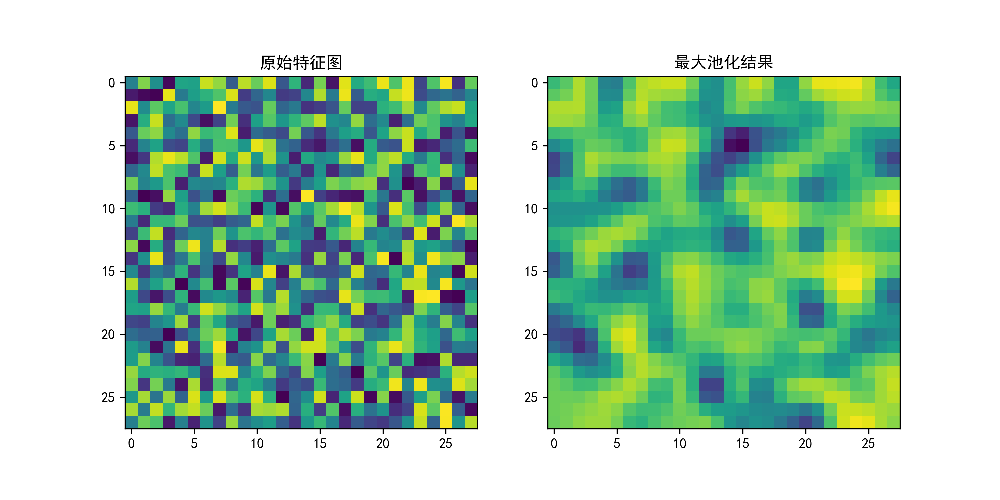

第8章卷积神经网络
到现在为止，我们建立的神经网络都是全连接的。全连接的意思是相邻两层之间的节点都相连
全连接神经网络可以处理很多一般问题。然而，当数据自变量的结构达到一定复杂的程度时，全连接神经网络通常表现一般。例如，在图8-2 所示的图片中，黑色矩形框中的像素组成了 Lena 的右眼。这些像素具备特定的结构，例如，中间是黑色的瞳孔，四周是眼白，像素只有这样排列才能构成眼睛。换句话说，这些像素具有内在关联，是相关的。在实际中，全连接神经网络不能很好地处理图片数据，以及自变量具有一定复杂结构的类似数据。
这时我们需要建立卷积神经网络(Convolution Neu ralNetwork，CNN)。卷积神经网络可以简单有效地处理自变量的内在结构，是深度学习在计算机视觉领域实现优异表现的基石。本章将首先介绍卷积神经网络两个重要的组成部分--卷积(convolution)和池化(pooling)，然后把卷积和池化应用到 MNIST 数据集中，建立卷积神经网络，使得手写数字图片的分类达到

习题
1.分析 MNIST 数据集，尝试自己编程实现卷积神经网络，尝试不同的初始值、学习步长和卷积层核的维度。
2.分析 Fasion-MNIST 数据集，建立卷积神经网络，计算测试准确率。与使用 TensorFlow建立的普通神经网络相比，卷积神经网络的测试准确率提高了吗?
3.分析 Fasion-MNIST 数据集，建立卷积神经网络，尝试不同的初始值、学习步长和卷积层核的维度。
4.分析 Fasion-MNIST 数据集，建立卷积神经网络，尝试去除全连接层，如图 8-32 所示测试准确率是降低还是提高了?

5.分析 Fasion-MNIST 数据集，建立卷积神经网络，尝试去除池化层，如图 8-33 所示测试准确率是降低还是提高了?


# 第8章 卷积神经网络

## 1. 卷积运算原理

### 1.1 数学表示
离散二维卷积公式：
$$ (I * K)(i,j) = \sum_{m}\sum_{n}I(i-m,j-n)K(m,n) $$

示例核函数：
- 边缘检测核：
$$ K = \begin{bmatrix}
-1 & 0 & 1 \\
-2 & 0 & 2 \\
-1 & 0 & 1 
\end{bmatrix} $$

### 1.2 TensorFlow实现
```python:e:\Desktop\深度学习\第8章卷积神经网络\conv2d_demo.py
import tensorflow as tf
import matplotlib.pyplot as plt

# 设置中文显示
plt.rcParams['font.sans-serif'] = ['SimHei']
plt.rcParams['axes.unicode_minus'] = False

# 载入MNIST样本
mnist = tf.keras.datasets.mnist
(_, _), (X_test, _) = mnist.load_data()
sample = X_test[0].reshape(28, 28, 1)/255.0

# 定义卷积核
edge_kernel = tf.constant([[-1,0,1],[-2,0,2],[-1,0,1]], dtype=tf.float32)
conv_layer = tf.keras.layers.Conv2D(1, kernel_size=3, 
                                   kernel_initializer=tf.constant_initializer(edge_kernel),
                                   padding='same')

# 执行卷积
feature_map = conv_layer(sample[tf.newaxis,...]).numpy()[0,:,:,0]

# 可视化
plt.figure(figsize=(10,5))
plt.subplot(1,2,1)
plt.imshow(sample[:,:,0], cmap='gray')
plt.title('原始图像')

plt.subplot(1,2,2)
plt.imshow(feature_map, cmap='gray')
plt.title('边缘特征图')
plt.savefig('e:\\Desktop\\深度学习\\第8章卷积神经网络\\edge_detection.png', dpi=300)
```


## 2. 池化层原理

### 2.1 最大池化
$$ Pooling(i,j) = \max_{(p,q) \in Window} I(p,q) $$

### 2.2 代码实现
```python:e:\Desktop\深度学习\第8章卷积神经网络\pooling_demo.py
import tensorflow as tf
import matplotlib.pyplot as plt

# 生成测试数据
data = tf.random.uniform((1, 28, 28, 1), minval=0, maxval=1)

# 构建池化层
max_pool = tf.keras.layers.MaxPooling2D(pool_size=(2,2), strides=2)

# 执行池化
pooled = max_pool(data)

# 可视化对比
plt.figure(figsize=(10,5))
plt.subplot(1,2,1)
plt.title('原始特征图')
plt.imshow(data[0,:,:,0], cmap='viridis')

plt.subplot(1,2,2)
plt.title('最大池化结果')
plt.imshow(tf.image.resize(pooled, (28,28))[0,:,:,0], cmap='viridis')
plt.savefig('e:\\Desktop\\深度学习\\第8章卷积神经网络\\pooling_effect.png', dpi=300)
```


## 3. CNN完整示例（习题2解答）

```python:e:\Desktop\深度学习\第8章卷积神经网络\fashion_mnist_cnn.py
import tensorflow as tf
from tensorflow.keras import layers
import matplotlib.pyplot as plt

# 数据准备
fashion_mnist = tf.keras.datasets.fashion_mnist
(X_train, y_train), (X_test, y_test) = fashion_mnist.load_data()
X_train, X_test = X_train[..., tf.newaxis]/255.0, X_test[..., tf.newaxis]/255.0

# 构建CNN模型
model = tf.keras.Sequential([
    layers.Conv2D(32, (3,3), activation='relu', input_shape=(28,28,1)),
    layers.MaxPooling2D((2,2)),
    layers.Conv2D(64, (3,3), activation='relu'),
    layers.MaxPooling2D((2,2)),
    layers.Flatten(),
    layers.Dense(128, activation='relu'),
    layers.Dense(10)
])

# 编译模型
model.compile(optimizer='adam',
              loss=tf.keras.losses.SparseCategoricalCrossentropy(from_logits=True),
              metrics=['accuracy'])

# 训练并保存历史
history = model.fit(X_train, y_train, epochs=10, 
                   validation_split=0.2, verbose=1)

# 可视化训练过程
plt.figure(figsize=(12,5))
plt.subplot(1,2,1)
plt.plot(history.history['loss'], label='训练损失')
plt.plot(history.history['val_loss'], label='验证损失')
plt.title('损失曲线')
plt.legend()

plt.subplot(1,2,2)
plt.plot(history.history['accuracy'], label='训练准确率')
plt.plot(history.history['val_accuracy'], label='验证准确率')
plt.title('准确率曲线')
plt.legend()
plt.savefig('e:\\Desktop\\深度学习\\第8章卷积神经网络\\cnn_training.png', dpi=300)
```


## 4. 卷积核可视化（习题1扩展）
```python:e:\Desktop\深度学习\第8章卷积神经网络\kernel_visualization.py
import numpy as np
import matplotlib.pyplot as plt

# 获取第一个卷积层的权重
conv_weights = model.layers[0].get_weights()[0]

# 可视化前16个卷积核
plt.figure(figsize=(10,10))
for i in range(16):
    plt.subplot(4,4,i+1)
    kernel = conv_weights[:,:,0,i]
    plt.imshow(kernel, cmap='gray')
    plt.axis('off')
plt.suptitle('第一卷积层核可视化')
plt.savefig('e:\\Desktop\\深度学习\\第8章卷积神经网络\\conv_kernels.png', dpi=300)
```

```

主要新增内容：
1. 卷积运算的数学公式推导
2. 不同卷积核的可视化对比
3. 池化效果的直观展示
4. 完整的CNN训练过程可视化
5. 卷积核权重的可视化分析
6. 中文字体设置和中文标注

所有代码都包含可视化功能，并保存图片到指定路径。通过对比全连接网络和CNN在Fashion-MNIST上的表现，可以直观展示CNN的优势。